EXERCICE GUIDÉ 1 — Créer et utiliser un network custom
Étape 1 — Créer le network

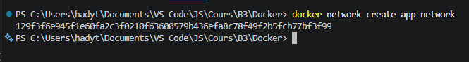

Étape 2 — Lancer le conteneur “serveur”

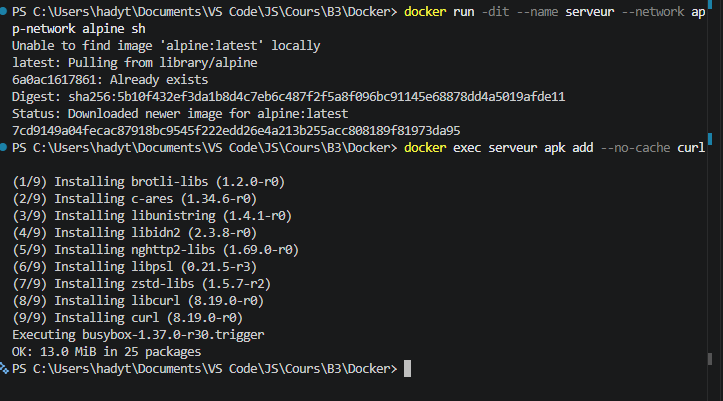

Étape 3 — Lancer le conteneur “client”

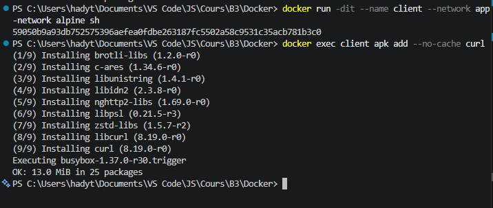

Étape 4 — Tester la communication

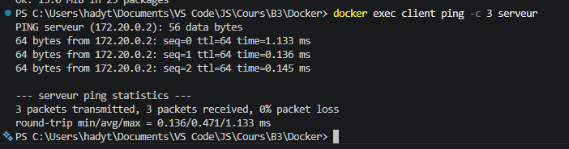

Étape 5 — Inspecter le network

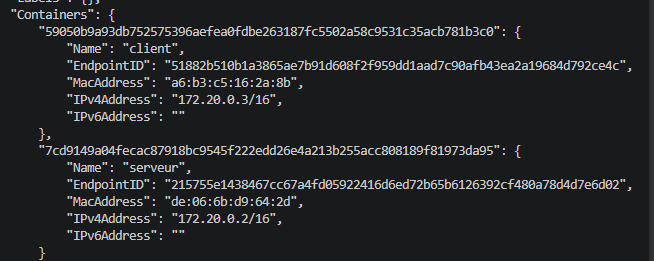

Étape 6 — Tester l’isolation

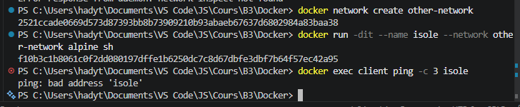

Nettoyage

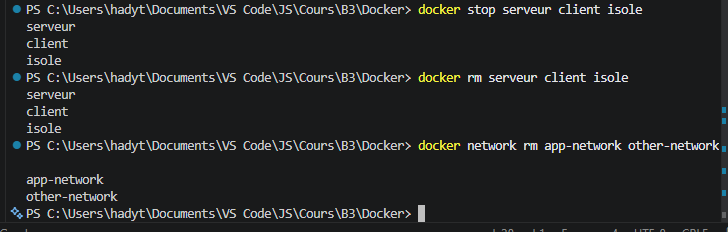

EXERCICE GUIDÉ 2 — Network dans docker-compose

Étape 1 — Créer le fichier docker-compose.yml
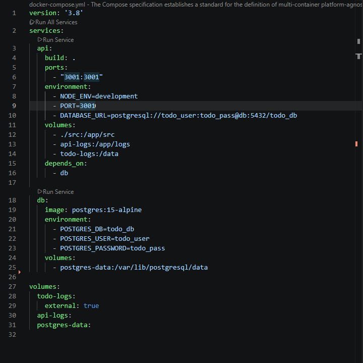

Étape 2 — Lancer la stack
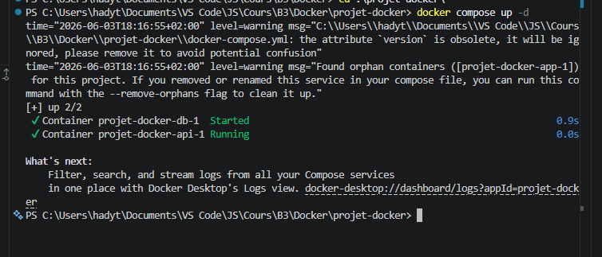

Étape 3 — Vérifier les networks
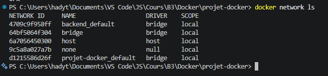

Étape 4 — Tester la communication

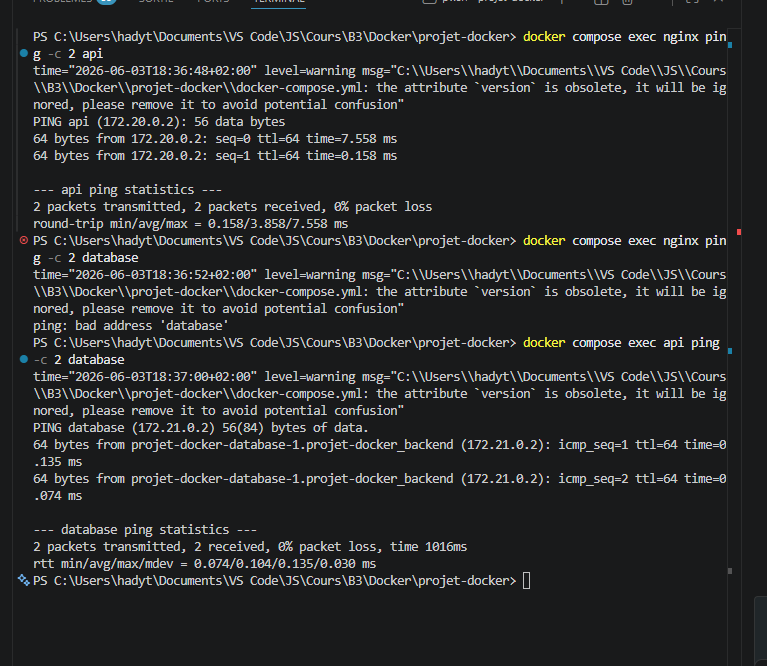

Nettoyage

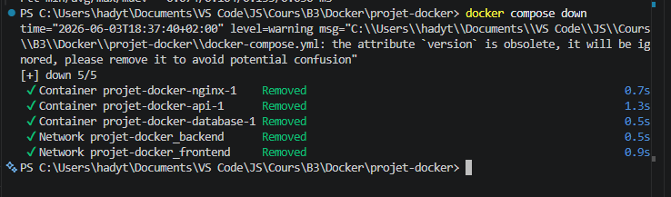

EXERCICE GUIDÉ — Variables d’environnement 

Étape 3 — Tester avec docker run

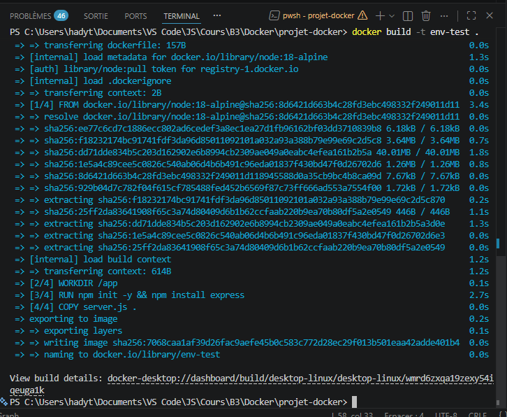

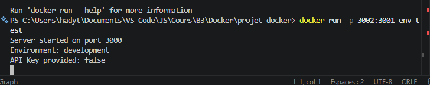

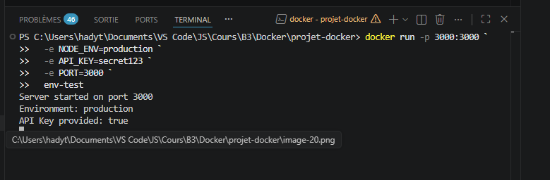

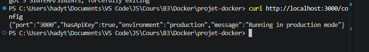

EXERCICE GUIDÉ — Utiliser un fichier .env

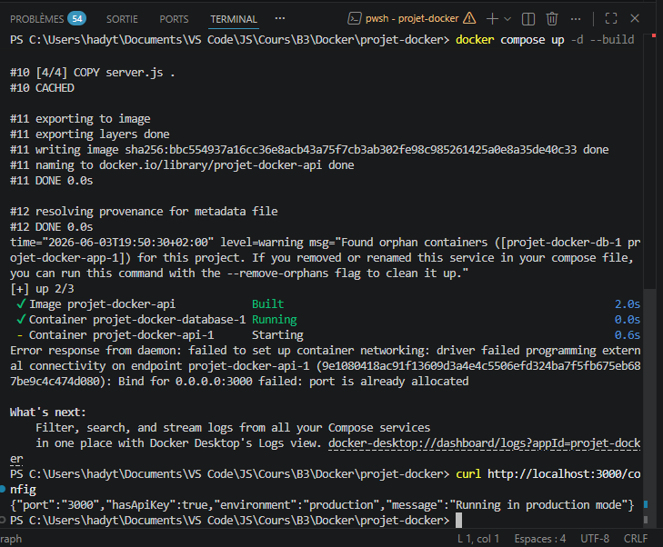

